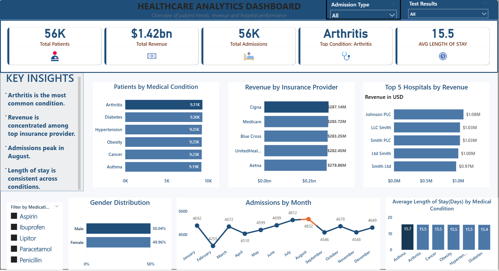

# Healthcare Analytics Dashboard
## Overview
This project presents a comprehensive Healthcare Analytica Dashboard designed to provide insights into patient trends, hospital performance and revenue distribution across different healthcare providers.The dashboard enables stakeholders to monitor key healthcare metrics, identify patterns and support data driven decision making.
## Objectives
* Analyze Patient admission trends
* Identify the most common medical conditions.
* Monitor hospital performance and operational efficiency
* Evaluate revenue distribution by insurance providers
## Dataset Information
The dataset used in this project contains healthcare related data focused on patient admissions, medical conditions, hospital performance and revenue generation. The dataset is a simulated healthcare dataset with over 50,000 entries created for analysis purposes.
## Key Insights
* Arthritis is the most common medical condition
* Revenue is highly concentrated, with the top insurance providers contributing majority of total revenue
* Patient admissions peak in August
* Average length of stay is consistent across conditions.
## Business Recommendations
* Allocate more resources toward high demand conditions such as arthritis to improve patient care and reduce strain on facilities
* Investigate lower performing hospitals to improve efficiency
* Strengthen partnership with top performing insurance providers
* Optimize hospital operations to maintain consistent patient care duration
## Tools Used
* Microsoft Excel; Data exploration and cleaning
* MYSQL; Querying, Data transformation and Analysis
* Power BI; Data Visualization

